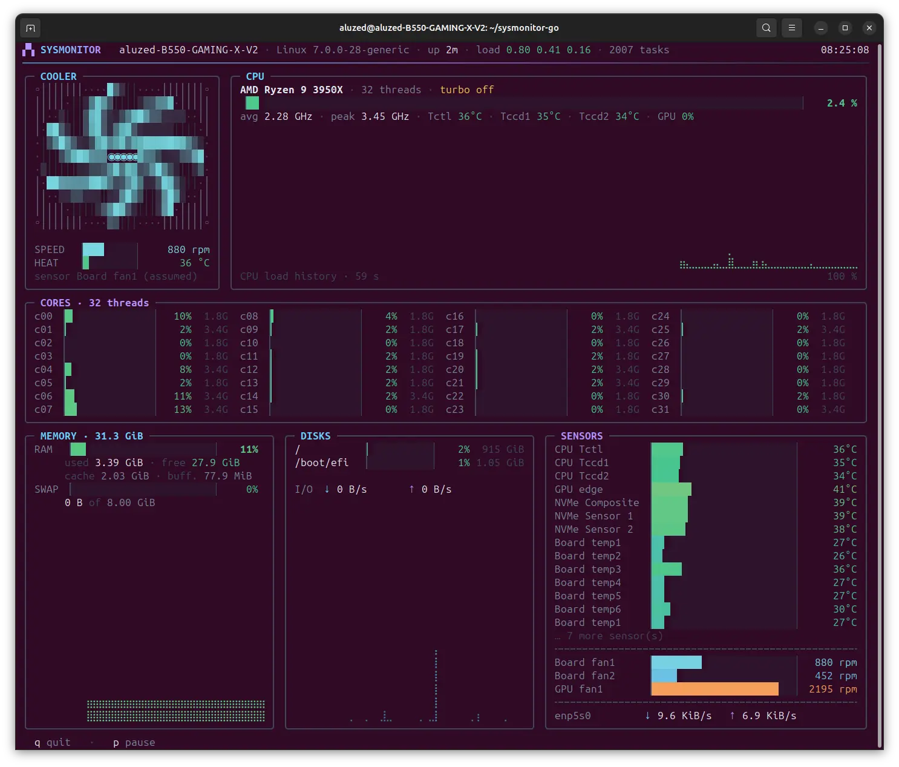

# sysmonitor-go



A terminal system dashboard for Linux. Written in Go with **no external
dependencies** — everything is read straight from `/proc` and `/sys`.

## Install

```sh
./install.sh
```

No privileges required. The script builds the binary and drops it in
`~/.local/bin`. **If Go is not installed on the machine, it downloads it into
`~/.local/go`** and uses it only for this build — nothing is added to your
`PATH`, nothing is installed system-wide.

```sh
PREFIX=/opt/sysmonitor ./install.sh   # another destination
./uninstall.sh                        # remove the binary
```

If you already have a Go toolchain, one line is enough:

```sh
go install github.com/aluzed/sysmonitor-go/cmd/sysmonitor@latest
```

Then:

```
sysmonitor
```

The project is called **sysmonitor-go**, the command is **`sysmonitor`** — the
suffix only distinguishes the repository, it is not something you should have
to type every day. To change the command name, edit the `NAME` variable at the
top of `install.sh` and `uninstall.sh`.

## What it shows

| Panel       | Contents |
|-------------|----------|
| **COOLER**  | An ASCII CPU cooler drawn in polar coordinates, with blades that genuinely rotate. Fan speed and heatsink temperature. |
| **CPU**     | Model, overall load, average and peak frequency, temperatures, turbo state, braille history graph. |
| **CORES**   | One htop-style gauge per thread, with its individual frequency. |
| **MEMORY**  | RAM and swap, cache and buffers, history. |
| **DISKS**   | Usage per filesystem, read/write throughput, history. |
| **SENSORS** | Every hwmon temperature, every fan, network throughput. |

## Usage

```
sysmonitor              # full screen, 15 fps
sysmonitor -fps 30      # smoother animation
sysmonitor -fps 4       # frugal
sysmonitor -once        # a single frame on stdout
sysmonitor -w 120 -h 40 # force dimensions (handy with -once)
sysmonitor -version     # build version
```

Keys: `q` quit · `p` (or space) pause.

## Layout

Three layouts, picked automatically from the terminal width:

- **≥ 114 columns** — cooler and CPU side by side, then memory, disks and
  sensors in a row of three.
- **68 to 113** — sensors move to their own full-width row.
- **< 68** — everything stacked in a single column.

The height is budgeted explicitly so the output lands exactly on the terminal
height. When room runs short the core grid collapses to a compact line (one bar
per thread), and panels that no longer fit are dropped rather than cut in half.
Best experienced at 120 × 40 or larger.

## Fans

Every `fan*_input` exposed by hwmon is read, whatever the chip and driver.
Headers reading 0 rpm are hidden: they are almost always empty sockets, and
they would fill the panel with nothing.

The cooler animation follows the CPU fan. When the driver provides no label, it
falls back to the first fan on the board Super-I/O — `fan1` is the CPU_FAN
header by near-universal convention. The sensor being followed is named under
the drawing, with an `(assumed)` marker when it is a guess. To force another
header:

```sh
SYSMONITOR_CPU_FAN="fan2" sysmonitor
```

If no fan is readable at all, the cooler spins in proportion to CPU load and
says so plainly (`no sensor → CPU load`).

### Chips the kernel does not support

Common on Gigabyte boards. The in-tree `it87` driver stops at `it8628` and knows
neither the **IT8688E/IT8689E** nor several other recent models. Symptom: no
fans besides the GPU, and `modprobe it87` stays silent.

The out-of-tree driver [frankcrawford/it87](https://github.com/frankcrawford/it87)
handles them. Install through DKMS so it is rebuilt on every kernel update:

```sh
git clone https://github.com/frankcrawford/it87.git
cd it87 && sudo ./dkms-install.sh
sudo modprobe it87
echo it87 | sudo tee /etc/modules-load.d/it87.conf   # load at boot
```

If the module loads but exposes nothing, ACPI is holding the chip. The
`ignore_resource_conflict=1` parameter overrides that for this driver only,
which is preferable to a system-wide `acpi_enforce_resources=lax`. Use it
knowingly: ACPI and the driver then poke the same registers.

ASUS and MSI boards generally use Nuvoton chips, supported out of the box by the
in-tree `nct6775` driver — nothing to install.

## Portability

Nothing here is vendor-specific. `/proc/stat`, `/proc/meminfo`, `/proc/diskstats`
and friends are universal; hwmon is enumerated dynamically, so unknown chips
still show up under their raw name. Turbo state is read from `cpufreq/boost`
(AMD) **or** `intel_pstate/no_turbo` (Intel), and CPU temperature from `Tctl`
/`Tdie` (AMD) **or** `Package` (Intel).

The one AMD-flavoured item is the GPU utilisation percentage, which comes from
`gpu_busy_percent`. On other GPUs that single field simply disappears from the
display.

## Files

| File | Role |
|------|------|
| `cmd/sysmonitor/collect.go` | Reads `/proc` and `/sys`, computes deltas. |
| `cmd/sysmonitor/render.go`  | 24-bit colour, bars, braille graphs, ANSI-aware string measurement. |
| `cmd/sysmonitor/cooler.go`  | Procedural rendering of the CPU cooler. |
| `cmd/sysmonitor/main.go`    | Layout, display loop, terminal handling. |
| `install.sh`                | Build and install, no privileges. |
| `uninstall.sh`              | Remove the binary. |

The sources live under `cmd/sysmonitor/` rather than at the repository root so
that `go install` produces a binary named `sysmonitor`, not `sysmonitor-go`.

To modify the program, read [DEVELOPMENT.md](DEVELOPMENT.md): architecture,
panel height contracts, ANSI rendering pitfalls, kernel source subtleties and
test recipes.

## Licence

MIT — see [LICENSE](LICENSE). Do whatever you want with it.

## Building by hand

```sh
go build -o sysmonitor ./cmd/sysmonitor
```

That is all: no dependencies, so no `go mod download`. `install.sh` merely adds
`-trimpath -ldflags "-s -w -X main.version=…"`, which takes the binary from
3.2 MB down to 2.2 MB and stamps in the version from `git describe`.

Binaries produced by `go install` carry no such stamp, so `-version` reads the
module version back from the build info the toolchain embeds. Either way the
command reports something meaningful.
